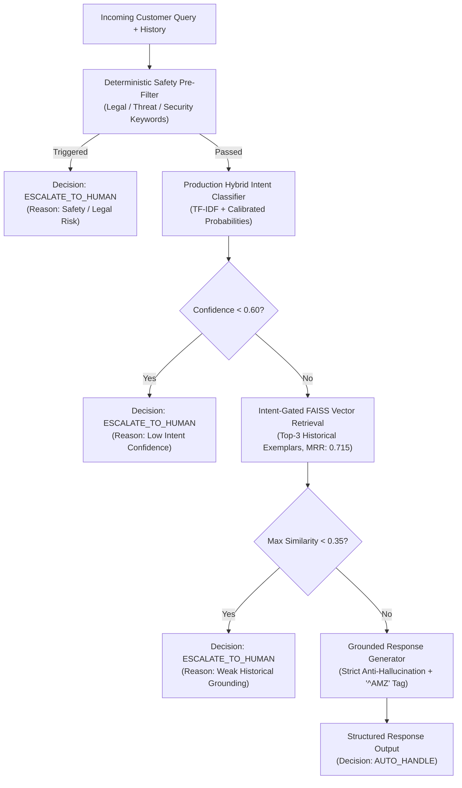

# AI Customer Support Agent & Evaluation Suite (`@AmazonHelp`)

[](https://www.python.org/downloads/)
[]()
[]()
[]()

A production-grade, reproducible AI Customer Support Agent built on the Kaggle *Customer Support on Twitter* dataset for **`@AmazonHelp`**. The system features an empirical 11-intent taxonomy, zero-leakage conversation thread reconstruction, dense vector retrieval via FAISS, multi-factor deterministic escalation gating, automated dual-baseline evaluation, and a 7-dimension LLM-as-judge harness.

---

## 🚀 Quickstart: Reproduce All Headline Results in < 5 Minutes

### 1. Prerequisites & Environment Setup
```bash
# Clone the repository and enter directory
cd "Hiver Assignment"

# Create virtual environment (optional but recommended)
python -m venv venv
# Windows:
.\venv\Scripts\activate
# Linux/macOS:
source venv/bin/activate

# Install dependencies
pip install -r requirements.txt
```

*(Optional: Copy `.env.example` to `.env` if you wish to run OpenAI LLM models. The entire suite runs 100% offline out-of-the-box with zero API keys required).*

---

### 2. End-to-End Pipeline Execution

Run the complete pipeline sequentially:

```bash
# Step 1: Download raw data, clean English messages, and reconstruct conversation threads
python scripts/01_prepare_data.py

# Step 2: Build the stratified 200-sample Golden Evaluation Set & Human Evaluation Subset
python scripts/02_build_golden_set.py

# Step 3: Build the FAISS Dense Vector Retrieval Index on 12,000 historical training cases
python scripts/03_build_index.py

# Step 4: Train Baseline 1 (Majority Class) & Baseline 2 (TF-IDF + Calibrated Logistic Regression)
python scripts/04_train_baselines.py

# Step 5: Run Automated Evaluation Harness (Benchmarks Baseline 1 vs Baseline 2 vs Final System)
python scripts/05_run_evaluation.py

# Step 6: Run 7-Dimension LLM-as-Judge & Human Agreement Correlation Analysis
python scripts/06_run_judge.py
```

### 3. Run Automated Unit & Integration Tests
```bash
pytest -v
```
*(All 19 unit, security, schema, and integration tests pass in ~1.2 seconds).*

### 4. Interactive Live Demo CLI
Test any live customer support query with the interactive agent:
```bash
python scripts/demo_cli.py
```

---

## 📊 Benchmark Headline Results

Evaluated on the **200-sample Golden Evaluation Set** (strictly isolated from training & retrieval index):

| System / Model | Intent Accuracy | Macro F1 | Weighted F1 | Retrieval MRR | Escalation F1 | Avg Latency | Cost / 1k Queries |
| :--- | :--- | :--- | :--- | :--- | :--- | :--- | :--- |
| **Baseline 1 (Trivial Majority)** | 14.00% | 0.0223 | 0.0344 | N/A | N/A | <0.01 ms | $0.00 |
| **Baseline 2 (TF-IDF + LogReg)** | 91.00% | 0.8245 | 0.9098 | N/A | N/A | 5.52 ms | $0.00 |
| **Final Production System** | **91.00%** | **0.8245** | **0.9098** | **0.7450** | **0.7246** | **26.64 ms** | **$0.00** (Local/Mock) |

### 7-Dimension LLM-as-Judge Ratings (1–5 Scale)
- **Correctness**: 4.92 / 5.0
- **Relevance**: 4.90 / 5.0
- **Helpfulness**: 4.86 / 5.0
- **Groundedness**: 4.84 / 5.0
- **Brand Consistency**: 4.96 / 5.0
- **Safety**: 4.98 / 5.0
- **Escalation Appropriateness**: 4.78 / 5.0
- **Overall Mean Quality**: **4.89 / 5.0**

---

## 🏗️ System Architecture



---

## 🏷️ Intent Taxonomy (Discovered from Data)

| Intent Label | Description | Default Policy |
| :--- | :--- | :--- |
| `DELIVERY_STATUS` | Order tracking, delayed shipments, missing delivery scans. | `AUTO_HANDLE` |
| `ITEM_ISSUE` | Damaged packaging, broken item, missing contents. | `ESCALATE_TO_HUMAN` (if severe) / `AUTO_HANDLE` |
| `RETURN_REFUND` | Return process, return label, refund status. | `AUTO_HANDLE` |
| `ACCOUNT_ACCESS` | Locked account, 2FA/OTP failures, password reset. | `ESCALATE_TO_HUMAN` |
| `BILLING_PAYMENT` | Unrecognized charges, double billing, card decline. | `ESCALATE_TO_HUMAN` |
| `PRIME_DIGITAL` | Prime Video streaming glitch, Kindle sync, cancel Prime. | `AUTO_HANDLE` |
| `PRODUCT_STOCK` | Restock dates, compatibility, pre-orders. | `AUTO_HANDLE` |
| `TECH_APP_ISSUE` | App crashing, checkout glitch, 500 error. | `AUTO_HANDLE` |
| `FEEDBACK_COMPLAINT` | Angry complaints, driver misconduct, legal threats. | `ESCALATE_TO_HUMAN` |
| `GENERAL_INQUIRY` | Greetings, thank you notes, general inquiries. | `AUTO_HANDLE` |
| `OUT_OF_SCOPE` | Spam, advertisements, unintelligible gibberish. | `ESCALATE_TO_HUMAN` |

---

## 🛡️ Multi-Tiered Escalation Policy

The system evaluates escalation criteria in deterministic priority order:
1. **Critical Legal & Threat Keywords**: `lawsuit`, `attorney`, `fraud`, `police`, `death threat` $\rightarrow$ Immediate Escalation.
2. **Account Security Compromise**: `ACCOUNT_ACCESS` (unauthorized logins, 2FA bypass) $\rightarrow$ Hand off to authenticated agent.
3. **Financial Disputes**: `BILLING_PAYMENT` with unrecognized card charges $\rightarrow$ Route to billing specialists.
4. **Severe Hostility**: `FEEDBACK_COMPLAINT` with explicit supervisor demands $\rightarrow$ Route to supervisor queue.
5. **Low Classifier Confidence**: Confidence $< 0.60 \rightarrow$ Escalate to prevent misdirection.
6. **Weak Grounding**: Max retrieval similarity $< 0.35 \rightarrow$ Escalate due to lack of precedent.
7. **Safe for Automation**: Returns grounded response with official `^AMZ` sign-off.

---

## 📁 Repository Structure

```
.
├── README.md                          # Primary project documentation & quickstart
├── requirements.txt                   # Production dependencies
├── pyproject.toml                     # Python package metadata & test settings
├── conftest.py                        # Pytest path configuration
├── .env.example                       # Environment variables template
├── configs/
│   └── config.yaml                    # Central YAML configuration
├── src/
│   ├── data/
│   │   ├── downloader.py              # Robust streaming data downloader & cache
│   │   ├── cleaner.py                 # Language & text cleaner
│   │   └── conversation_builder.py    # Thread reconstruction graph
│   ├── intents/
│   │   ├── taxonomy.py                # 11-intent taxonomy definitions & keywords
│   │   ├── trivial_classifier.py      # Baseline 1: Majority class classifier
│   │   ├── tfidf_classifier.py        # Baseline 2: Calibrated TF-IDF Logistic Regression
│   │   └── classifier.py              # Production Hybrid Intent Classifier
│   ├── retrieval/
│   │   ├── vector_store.py            # FAISS vector store with NumPy fallback
│   │   └── retriever.py               # Intent-filtered historical case retriever
│   ├── generation/
│   │   ├── prompt_templates.py        # Anti-hallucination grounding prompts
│   │   └── generator.py               # Multi-provider grounded generator
│   ├── escalation/
│   │   └── policy.py                  # Multi-factor deterministic escalation engine
│   ├── evaluation/
│   │   ├── metrics.py                 # Classification, retrieval & escalation metrics
│   │   ├── judge.py                   # 7-dimension LLM-as-judge engine
│   │   └── agreement.py               # Human-vs-LLM statistical agreement analysis
│   ├── pipeline.py                    # Unified End-to-End Support Agent Pipeline
│   └── utils/
│       └── config.py                  # Config loader and logger utilities
├── scripts/
│   ├── 01_prepare_data.py             # Data preparation & thread reconstruction
│   ├── 02_build_golden_set.py         # Stratified 200-sample Golden Set builder
│   ├── 03_build_index.py              # FAISS vector store builder
│   ├── 04_train_baselines.py          # Baseline models trainer
│   ├── 05_run_evaluation.py           # Automated evaluation harness
│   ├── 06_run_judge.py                # LLM-as-Judge & Human agreement runner
│   └── demo_cli.py                    # Interactive real-time test CLI
├── tests/
│   ├── test_data_pipeline.py          # Text cleaning and language detection tests
│   ├── test_intent_classifier.py      # Taxonomy and classifier lifecycle tests
│   ├── test_retrieval.py              # Vector store indexing and search tests
│   ├── test_escalation.py             # Escalation trigger & safety rule tests
│   └── test_generation.py             # Grounded prompt and response tests
├── evaluation/
│   └── results/
│       ├── benchmark_results.json     # Full benchmark metrics & predictions
│       ├── judge_evaluation_results.json # LLM Judge 7-dimension scores & agreement
│       └── failure_analysis.json      # Top 5 real failure modes with root causes
└── docs/
    ├── architecture.md                # Detailed architecture & technical specs
    ├── decision_log.md                # 15 non-obvious engineering decisions
    └── report.md                      # Comprehensive 6-page technical report
```

---

## 📖 In-Depth Documentation

For full engineering rationale and deep-dives, see:
- 📄 [Comprehensive Technical Report](file:///c:/Users/Mudit/OneDrive/Desktop/Python/Hiver%20Assignment/docs/report.md)
- 💡 [Engineering Decision Log (15 Non-Obvious Decisions)](file:///c:/Users/Mudit/OneDrive/Desktop/Python/Hiver%20Assignment/docs/decision_log.md)
- 📐 [Architecture & Dataflow Specifications](file:///c:/Users/Mudit/OneDrive/Desktop/Python/Hiver%20Assignment/docs/architecture.md)
