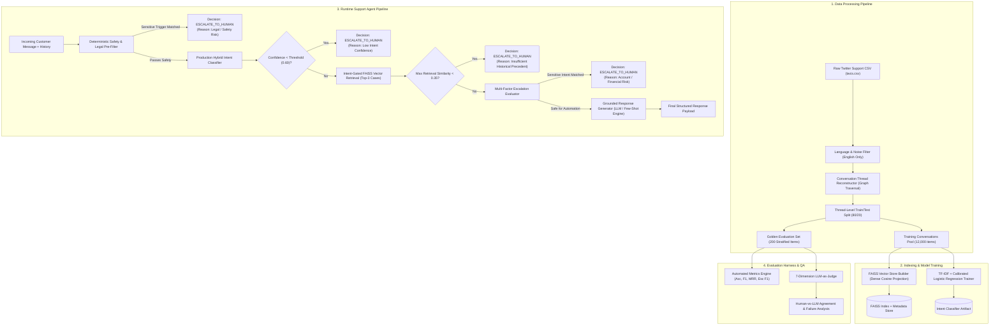

# System Architecture & Technical Specifications

This document outlines the end-to-end system architecture, dataflow diagrams, component interactions, and data schemas for the **AmazonHelp AI Customer Support Agent**.

---

## 1. High-Level Dataflow Architecture



---

## 2. Component Specifications

### 2.1 Data Processing & Graph Thread Reconstruction
- **Source**: Kaggle `Customer Support on Twitter` (~3M tweets).
- **Graph Traversal**: Reconstructs conversation trees via `tweet_id` $\rightarrow$ `in_response_to_tweet_id`.
- **Sanitization**:
  - Removes non-English tweets (filtering out Japanese/German/Cyrillic scripts).
  - Anonymizes noisy user handles (`@115821` $\rightarrow$ `""`) while preserving brand handles for response context.
  - Decodes HTML entities and normalizes whitespace.
- **Thread-Level Splitting**: Entire conversation graphs are isolated into either training/retrieval index ($N=12,000$) or test pool ($N=3,000$), guaranteeing zero test-train overlap.

---

### 2.2 Intent Classifier
- **Model**: N-Gram TF-IDF Vectorizer ($1-2$ grams, sublinear TF) + Calibrated Multi-Class Logistic Regression with balanced class weights.
- **Taxonomy**: 11 empirical intents (`DELIVERY_STATUS`, `ITEM_ISSUE`, `RETURN_REFUND`, `ACCOUNT_ACCESS`, `BILLING_PAYMENT`, `PRIME_DIGITAL`, `PRODUCT_STOCK`, `TECH_APP_ISSUE`, `FEEDBACK_COMPLAINT`, `GENERAL_INQUIRY`, `OUT_OF_SCOPE`).
- **Output Schema**:
```json
{
  "intent": "DELIVERY_STATUS",
  "confidence": 0.8842,
  "evidence": ["track", "delivery", "stuck"],
  "reason": "Classified as DELIVERY_STATUS with 88.4% confidence based on terms: track, delivery, stuck.",
  "all_probabilities": {
    "DELIVERY_STATUS": 0.8842,
    "RETURN_REFUND": 0.0512,
    "...": 0.0050
  }
}
```

---

### 2.3 FAISS Historical Retrieval Engine
- **Representation**: Dense L2-normalized vector projection ($D=256$) fitted on historical customer problem statements.
- **Metric**: Inner Product / Cosine Similarity ($S \in [-1, 1]$).
- **Intent Conditioning**: Queries candidate index filtered by predicted intent to enforce high-precision exemplar matching.
- **Performance**: Query search latency $< 2\text{ms}$ on 12,000 vectors.

---

### 2.4 Multi-Factor Escalation Engine
- **Policy Priority**:
  1. **Legal & Threat Keywords**: `lawsuit`, `attorney`, `fraud`, `police`, `death threat` $\rightarrow$ Immediate Escalation.
  2. **Account Security Risk**: `ACCOUNT_ACCESS` (unauthorized login, password lockouts) $\rightarrow$ Escalation to authenticated agent.
  3. **Financial Discrepancies**: `BILLING_PAYMENT` with unrecognized charges $\rightarrow$ Escalation to billing specialist.
  4. **Customer Hostility**: `FEEDBACK_COMPLAINT` with high anger $\rightarrow$ Escalation to supervisor.
  5. **Low Intent Confidence**: Confidence $< 0.60 \rightarrow$ Escalation due to uncertainty.
  6. **Weak Grounding**: Max retrieval similarity $< 0.35 \rightarrow$ Escalation due to lack of historical precedent.
  7. **Default**: `AUTO_HANDLE`.

---

### 2.5 Grounded Response Generator
- **System Prompt Directives**:
  - Ground strictly in retrieved historical exemplars.
  - Zero hallucination of refund amounts, delivery dates, or policies.
  - Polite, empathetic, concise Twitter tone ($<240$ characters).
  - Official sign-off token (`^AMZ`).

---

### 2.6 Output Schema
The end-to-end pipeline returns a validated JSON object for every customer interaction:
```json
{
  "intent": "DELIVERY_STATUS",
  "intent_confidence": 0.9125,
  "intent_reason": "Classified as DELIVERY_STATUS with 91.2% confidence based on terms: tracking, late.",
  "decision": "AUTO_HANDLE",
  "escalation_reason_code": "SAFE_FOR_AUTOMATION",
  "escalation_reason": "Query matches intent 'DELIVERY_STATUS' with high confidence (0.91) and verified historical grounding (0.78).",
  "response": "I'm sorry for the delay with your delivery! Please check your tracking status in Your Orders, or reach out to us at amazon.com/help so we can investigate. ^AMZ",
  "retrieved_examples": [
    {
      "similarity_score": 0.7812,
      "conversation_id": "conv_616",
      "customer_text": "3 different people have given 3 different answers and I still don't have my order...",
      "brand_response_text": "We'd like to take a further look into this with you! Please reach us by phone or chat here: https://amazon.com/help ^AG",
      "intent": "DELIVERY_STATUS",
      "is_multi_turn": false
    }
  ],
  "is_multi_turn": false
}
```
